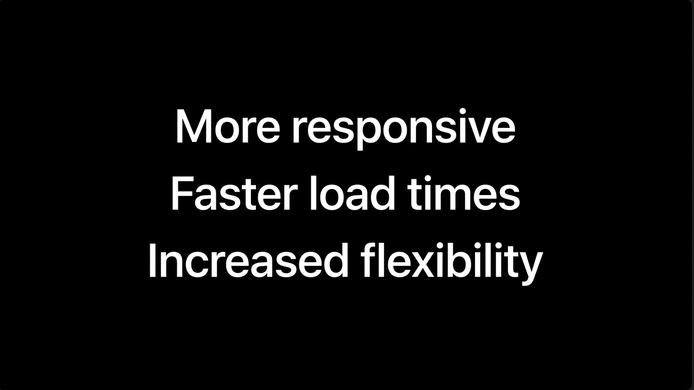

# 📍 meeter <!-- omit in toc -->
<p align="center">
  
</p>

meet within meters, **meeter** 는 w3w 좌표체계를 기반으로, 나와 친구의 정확한 위치를 확인하고 실시간으로 공유할 수 있는 **하이퍼로컬 모바일 앱**입니다.

<hr>

# 🎬 Preview <!-- omit in toc -->
구글 로그인 + 최초 지도 화면 | 친구 추가 및 요청 관리
:-------------------------:|:-------------------------:
  |  

## 👨‍👩‍👧‍👧 친구 4명이 실시간으로 위치를 공유한다면?
사용자 1 | 사용자 2 | 사용자 3 | 사용자 4
:-------------------------:|:-------------------------:|:-------------------------:|:-------------------------:
  |    |    |  

## 🚨 정밀한 w3w 위치값 활용 (긴급신고, 위치공유)
112 · 119 긴급신고 | 카카오맵 위치공유
:-------------------------:|:-------------------------:
  |  

<hr>

# 🤠 Try It Out <!-- omit in toc -->
위 미리보기가 흥미로우셨나요?

iPhone을 사용하신다면, **[이 Apple TestFlight 링크를 통해](https://testflight.apple.com/join/nrlNSHda) meeter를 직접 체험해보세요!**

<details>
<summary><strong>Apple TestFlight로 meeter 체험하기</strong></summary>
<p>

* Apple TestFlight는 iOS 기반으로 개발된 앱이 App Store에 정식 출시되기 전에, 개발자가 자유롭게 베타 테스트를 진행할 수 있는 Apple이 제공하는 플랫폼입니다.
* TestFlight에 게시되는 베타 빌드 또한 Apple의 꼼꼼한 검수를 받기에, 안심하고 다운받아 사용하셔도 돼요.
* 익명의 베타 테스터로 참가하시게 되며, 앱 호환성 검토를 위한 간단한 기기정보를 제외한 그 어떠한 개인정보도 수집되지 않아요.
* **meeter는 현재 구글 소셜 로그인을 지원하고 있어요.** 만약 구글 로그인이 불편하시다면, 이 로그인 정보를 사용하세요. Apple 심사 팀에서도 이 계정정보를 활용해서 앱을 테스트했답니다.
  * **ID** meeter.ios@gmail.com
  * **PW** MeeterIos0101@
* 베타 테스트 도중 문제나 버그가 발견되었을 때, 개발자에게 스크린샷과 함께 피드백을 전송할 수 있어요. 보내주신 피드백은 세심하게 검토해서, 다음 빌드에 최대한 반영하는 것을 목표로 하고 있어요.

</p>
</details>

<br>

Android 휴대폰을 사용하시거나 지금 당장은 체험이 어렵다면, 시연이 포함된 5분 내외의 meeter 발표 영상을 보실 수도 있어요 :wink:

<p align="center">
  <a href="https://www.youtube.com/watch?v=dTFjQ8IDwvA&t=716s">
    
  </a>
</p>

<hr>

# :book: Table of Contents <!-- omit in toc -->
- [🎨 Tech Stack](#-tech-stack)
  - [🧐 Why React Native + Expo](#-why-react-native--expo)
    - [Expo](#expo)
  - [🧐 Why Zustand](#-why-zustand)
- [🎢 Challenges](#-challenges)
  - [실시간 위치 데이터를 어떻게 효율적으로 다룰까?](#실시간-위치-데이터를-어떻게-효율적으로-다룰까)
    - [GPS 위치센서는 배터리 도둑 🪫](#gps-위치센서는-배터리-도둑-)
    - [기기가 움직였을 때만 GPS를 사용하자](#기기가-움직였을-때만-gps를-사용하자)
    - [네이티브 기기가 가속도 값을 제공하긴 하는데.. :thinking:](#네이티브-기기가-가속도-값을-제공하긴-하는데-thinking)
    - [일반 가속도 값을 선형 가속도 값으로 변환하기](#일반-가속도-값을-선형-가속도-값으로-변환하기)
    - [기기가 확실히 움직였을때만 작동하는 GPS](#기기가-확실히-움직였을때만-작동하는-gps)
    - [과도한 소켓 통신](#과도한-소켓-통신)
  - [최초 지도 화면, 어떻게 빠르고 정확하게 로딩할까?](#최초-지도-화면-어떻게-빠르고-정확하게-로딩할까)
    - [로딩 지연 원인에 대한 가설 수립 및 검증](#로딩-지연-원인에-대한-가설-수립-및-검증)
    - [라이브러리의 편리함에 속아 주도권을 잃다](#라이브러리의-편리함에-속아-주도권을-잃다)
    - [WebView와 MapKit JS 직접 연결](#webview와-mapkit-js-직접-연결)
    - [번외 1) 라이브러리를 유지한다고 전제했을 때, 고려한 방법들](#번외-1-라이브러리를-유지한다고-전제했을-때-고려한-방법들)
    - [번외 2) 그럼 `react-native-maps` 라이브러리는 왜 여전히 많은 사람들이 쓰는건데..? :thinking:](#번외-2-그럼-react-native-maps-라이브러리는-왜-여전히-많은-사람들이-쓰는건데-thinking)
  - [자기참조형 데이터 모델링을 이용한 용량 효율적인 쿼리 구현](#자기참조형-데이터-모델링을-이용한-용량-효율적인-쿼리-구현)
- [:books: Lessons Learned](#books-lessons-learned)
  - [사용자 경험 중심의 지속적인 제품 개선의 중요성](#사용자-경험-중심의-지속적인-제품-개선의-중요성)
  - [능동적이고 창의적인 문제해결의 즐거움](#능동적이고-창의적인-문제해결의-즐거움)

<hr>

# 🎨 Tech Stack
* React Native
* Expo
* Zustand
* Socket.IO
* Apple MapKit JS
* Node.js
* Express
* MongoDB
* Apple TestFlight
* AWS Elastic Beanstalk

<!-- | React Native | Expo | Zustand | Socket.IO | Apple MapKit |
| --- | --- | --- | --- | --- |
| | 

| Node.js | Express | MongoDB | Apple TestFlight | AWS EB |
| --- | --- | --- | --- | --- |
| | | -->

## 🧐 Why React Native + Expo
React Native는 Flutter과 더불어 널리 쓰이는 **하이브리드, 크로스 플랫폼 앱 개발 프레임워크**입니다. React에 익숙한 제가 모바일 앱을 만들고자 했을 때, React Native를 선택하는 것은 어떻게 보면 당연한 수순이었습니다.

하지만 웹 환경과 현저히 다른 모바일 환경에서, 그 고유의 UI/UX를 고려하며 개발하는 경험은 매우 신선하고 흥미로웠습니다.

### Expo
Expo는 단연코 React Native를 개발하기 위한 최고의 플랫폼이라고 생각합니다. 초기 환경 세팅부터 라우팅, 빌드 및 배포까지 — 기능 구현 자체에 필수적이지 않은 각종 요소들이 추상화되어 있는 **Expo 덕분에 개발과 최적화에 집중할 수 있었습니다**.

유일한 단점은 Expo에 대한 의존성이 상당히 높아진다는 점인데 (실제로 의존성 패키지의 절반 이상이 Expo 패키지입니다), Expo는 빠르게 업데이트 되고 안정적으로 발전하고 있는 생태계이며, React Native 공식 문서에서도 [Expo로 앱을 시작하는 것을 소개](https://reactnative.dev/docs/environment-setup)하고 있을 만큼 신뢰할 수 있는 플랫폼이라고 생각합니다.

아래는 제가 meeter를 개발하면서 유용하게 사용했던, Expo가 지원하는 주요기능들입니다.

* `create-expo-app` 사용으로 React Native CLI보다 훨씬 빠르게 초기 개발환경 설정
* `expo-router` 으로 모바일 환경에 더욱 직관적인 file-based routing 구현
* `Expo Go` 모바일 앱으로 **HMR 기반의 신속한 앱 테스팅**이 가능
* `Expo Prebuild` 를 통해 Expo SDK 생태계에서 확장하여, **네이티브 코드를 문제없이 결합해 사용할 수 있음**. 실제로 OAuth 기반의 사용자 인증을 구현할 때 Expo Prebuild가 매우 유용했음
* `EAS Build`를 통해 앱을 편리하게 빌드하고, `EAS Submit`을 통해 App Store 및 Play Store에 손쉽게 배포하며, 배포 후에는 `EAS Update`를 통해 마이너 패치의 경우 스토어 심사 없이도 사용자에게 변경사항을 ship 하는 Over-The-Air 업데이트를 사용할 수 있음

## 🧐 Why Zustand
프로젝트 기능과 특성, 개발기간을 고려하여 아래와 같은 상태관리 툴 선택기준을 세웠고, 가장 적합한 Zustand를 선택했습니다.

* Redux보다 상태 관리를 위한 절대적인 코드 양이 적으며, 사용이 직관적이고, 패키지 사이즈가 작아야 함
* 이후 백그라운드 위치 권한 및 기능을 추가할 때, **컴포넌트 외부에서도 상태 변경이 가능해야 함**
* 현재 위치정보는 클라이언트 상태로만 관리되고 있고, 서버 상태를 클라이언트가 사용할 경우는 거의 없음
* npm trend 등에서 주간 사용자 수가 많아야 하며, 안정적으로 유지보수되고 있는 패키지여야 함

# 🎢 Challenges

## 실시간 위치 데이터를 어떻게 효율적으로 다룰까?
위치 데이터만큼이나 그 정확도와 실시간성이 중요한 데이터가 있을까요? 위치 데이터를 이용하는 대표적인 서비스인 내비게이션만 생각해 보아도, 위치 데이터는 **얼마나 실시간에 가깝게, 얼마나 적은 오차**로 현재 위치를 나타낼 수 있는가에 따라 그 가치가 좌우됩니다.

그럼 실시간으로 나와 내 친구의 위치를 지도에 표시해준다 — 라는 핵심 기능을 약속한 meeter 앱에서는 어떻게 실시간 위치 데이터를 다뤄야 할까요? 이상적으로는, meeter 앱이 켜져 있는 내내 GPS로 내 현재 위치를 지속적으로 모니터링해서, 새로운 위치값이 확인될때마다 위치 마커를 새로이 re-rendering 하고, 동시에 내 모든 친구들에게 소켓을 통해 새로운 위치값을 알려주면 되겠죠.

**하지만 현실은 녹록치 않았습니다.**

만약 앱 사용 내내 GPS로 내 현재 위치를 모니터링한다면, 위치가 딱히 변하지 않아도 GPS는 계속해서 휴대폰 배터리를 소모하고 있게 됩니다.

뿐만 아니라, 정말 자그마한 움직임에도 새로운 위치값을 친구들에게 소켓으로 전송한다면, 소켓 부하가 상당할 것입니다. 만약 meeter 앱을 100명, 1000명의 사용자가 동시에 사용하게 된다면, 이 부하는 서비스 안정성에 치명적일 수 있습니다.

그래서 저는 실시간 위치 데이터가 처리되는 과정을 **2단계로 나누어 정의했고, 단계별로 최적화를 진행**했습니다.

1. 기기가 GPS를 사용해 위치 데이터를 받아오는 과정
2. 갱신된 새로운 위치 데이터를 소켓과 서버로 보내는 과정

<br>

### GPS 위치센서는 배터리 도둑 🪫
사실 저도 개발 후 베타 테스트 단계에서야 이 점을 체감했는데요, **GPS는 스마트폰 배터리를 충격적으로 많이 소모합니다**.

> Nonetheless, even with A-GPS, using your GPS is a noticeable battery hog. This is again due not to powering the GPS itself, but by preventing the phone from going to sleep. Compounding the cost, most mapping software is processor-intense. A well-designed app can make a significant difference here; Google Maps boasts several optimizations to reduce battery consumption from GPS usage.
>
> — Robert Love, Senior Director of Engineering at Google Cloud Platform, on ["Why does GPS use so much more battery than any other antenna or sensor in a smartphone?"](https://qr.ae/pK3Q0m) asked on Quora

위 답변에서도 확인할 수 있듯, GPS는 그 특유의 매우 느린 통신 속도와, 기기를 잠들지(sleep) 못하게 하는 특성 때문에 배터리를 많이 사용합니다.

이 사실에 슬퍼하면서도, 저는 동시에 답변의 마지막 문장에 주목했습니다: `잘 디자인된 앱은 획기적인 차이를 만들어낼 수 있습니다. Google Maps는 GPS 사용에 따른 배터리 소모를 줄이기 위해 여러 최적화 기술을 자랑합니다.`

물론 meeter 앱이 구글 맵 수준의 최적화를 달성할 순 없겠지만, 어떻게 하면 **위치 데이터의 가치를 유지하면서도 GPS 사용을 최대한 줄일 수 있을지 고민**했습니다.

<br>

### 기기가 움직였을 때만 GPS를 사용하자
GPS 사용을 최대한 줄인다는 것은 곧, **꼭 필요할때만 GPS를 사용하도록 한다**는 것입니다. 그럼 GPS 사용이 꼭 필요할 때는 언제일까요? 사용자의 위치가 바뀌면, 그 새로운 위치정보를 받아오기 위해 GPS를 사용해야 합니다. 반면에, 사용자의 기기는 가만히 있는데 GPS만 계속해서 위치를 모니터링하고 있는 상황은 피해야 하죠.

하지만 역설적이게도, 기기가 움직였는지를 알려면 결국 GPS를 사용해야하는 듯 했습니다. **GPS로 받아 온 조금 전의 위치와 현재 위치를 비교하여 기기가 움직였는지를 판단하기 때문이죠.** 심지어 React Native Community에서 제공하는 `Geolocation API` 또한 이러한 방식으로 사용자 기기가 움직였는지를 판별하고 있었습니다. 결국 GPS를 사용하지 않고 사용자 기기의 움직임을 탐지하겠다는 시도는 애초에 말이 안되는 듯 보였습니다.

그 순간, iPhone의 두 가지 흥미로운 기능들이 제 뇌리를 스쳤습니다. iPhone은 GPS 위치센서가 꺼져 있어도, 사용자가 교통사고를 당했는지, 또는 운전중인지를 감지할 수 있습니다. **어떻게 GPS 없이 이러한 사용자의 움직임을 파악할 수 있을까요?**

<p align="center">
  
</p>

> So how does this technology work? The new iPhone models, along with the Watch Series 8 and Ultra, have **a 3-axis gyroscope and a high G-4 accelerometer, which samples motion at over 3000 times a second**. It means that when a car is going really fast and then abruptly stops or slows down, it's able to sense the precise moment of impact, or the change in that motion.
>
> — The Wall Street Journal, [Does Apple's Crash Detection Work? We Totaled Some Cars To Find Out.](https://youtu.be/0nTQIvfVHrw?si=XZvy5xZ15Ra_2lz5&t=220)

모든 스마트폰에는 가속도센서(accelerometer)가 내장되어 있는데, 이는 GPS 센서와 다르게 별도의 통신을 요하지도, 따라서 배터리도 거의 소모하지 않습니다. iPhone은 기기의 움직임 여부와 그 정도를 측정할 수 있는 가속도센서와 자체 알고리즘을 활용해서, 사용자의 비정상적이거나 특이한 움직임 패턴을 탐지해냅니다.

이 점에 착안해서, meeter는 **가속도센서의 작동을 곧 사용자의 움직임으로 간주하고, 비로소 GPS 위치센서를 작동**합니다. 이렇게 기기가 확실히 움직였을 때만 GPS를 사용하도록 설계하여, 불필요한 GPS 작동을 막고 기기 성능과 배터리 효율을 높였습니다.

<br>

### 네이티브 기기가 가속도 값을 제공하긴 하는데.. :thinking:
그럼 네이티브 기기의 가속도센서 측정값을 어떻게 사용할 수 있을까요? Apple은 `Core Motion` 프레임워크를 통해 [일반 가속도 값(raw acceleration)을 제공](https://developer.apple.com/documentation/coremotion/getting_raw_accelerometer_events)합니다.

<p align="center">
  
</p>

위 그림과 같이, 가속도센서는 `x`, `y`, `z` 3차원 축을 따라 작용하는 가속도 측정값을 제공합니다.

그리고 저는 이를 이용하는 Expo의 `expo-sensors` 를 통해 일반 가속도 값에 접근할 수 있었습니다. 아래 화면은 제가 휴대폰을 평평한 책상 위에 가만히 놓고 측정한 일반 가속도 값입니다.

<p align="center">
  
</p>

그런데 뭔가 이상하지 않나요? **기기는 `x`, `y`, `z`축 어떤 방향으로도 움직이지 않고 있는데, `z`축 가속도 값은 `-1`로 수렴하는 것으로 보입니다**.

이는 바로 가속도 센서가 제공하는 일반 가속도 값이 지구가 기기를 끌어당기는 중력 또한 기기에 적용되는 '움직임'이라고 간주해서, 중력이 작용하는 방향으로 `1g = 9.81m/s^2` 만큼의 값을 항상 포함하고 있기 때문입니다.

그래서 화면을 위로 한 채로 평평한 책상 위에 둔 제 휴대폰에는 `-z`축 방향으로 `1g`만큼 중력이 작용하고 있었고, 그래서 `z`축 일반 가속도 값은 `-1`로 나타났던 것입니다.

하지만 저는 중력이 작용하는 방향과 관계없이 순수 사용자의 움직임만으로 발생하는 기기의 가속을 측정해야 하기에, **`일반` 가속도 값에서 중력의 영향을 제거한 `선형` 가속도 값을 구해서 사용하기로 결정**했습니다.

<br>

### 일반 가속도 값을 선형 가속도 값으로 변환하기
일반 가속도 값은 뉴턴의 제2법칙인 가속도의 법칙 $F = ma$ 로부터 출발합니다. 여기서 $F$ 는 알짜힘(합력), 즉 쉽게 말하면 작용하는 힘, $m$ 은 질량, $a$ 는 가속도를 의미합니다.

이 공식을 활용해서 네이티브 기기가 제공하는 일반 가속도 값을 정의해 볼 수 있습니다.

$$A_D = -\frac{1}{m} \sum F_S - g$$

여기서 $A_D$ 는 기기에 작용하는 가속도 (**A**cceleration on **D**evice), $m$ 은 질량, $F_S$ 는 가속도 센서 자체에 작용하는 힘 (**F**orce on **S**ensor)을 각각 의미합니다. 또한 앞서 살펴보았듯이, 일반 가속도 값은 항상 중력을 포함하여 계산되기에, 중력 (**g**ravity)을 의미하는 $g$ 도 포함됩니다.

일반 가속도 값을 선형 가속도 값으로 변환하기 위해서는, 중력 $g$ 의 작용을 제거해줘야 합니다. 위와 유사하게 선형 가속도를 정의해 보면:

$$L_D = -\frac{1}{m} \sum F_S$$

디바이스에 작용하는 중력 가속도 값 $g$ 를 추정하기 위한 방법은 여러가지가 있습니다. 이 중, 저는 low-pass filter 를 활용한 추정 방법을 선택했습니다. 물론 기기의 자이로센서 등을 활용해서 좀 더 정확한 추정치를 계산할 수도 있겠지만, 필터링 방식보다 훨씬 복잡하며, 현재 문제 상황에서 매우 정밀한 보정 작업은 불필요하다고 판단했기 때문입니다.

<details>
<summary><strong>low-pass filter를 활용한 중력 가속도 제거 (코드)</strong></summary>
<p>

```javascript
export default function App() {
  const [{ x, y, z }, setRawAcc] = useState({
    x: 0,
    y: 0,
    z: 0,
  });

  const [{ linearAccX, linearAccY, linearAccZ }, setLinearAcc] = useState({
    linearAccX: 0,
    linearAccY: 0,
    linearAccZ: 0,
  });
  const [subscription, setSubscription] = useState(null);

  const _slow = () => Accelerometer.setUpdateInterval(1000);
  const _fast = () => Accelerometer.setUpdateInterval(100);

  const alpha = 0.8;
  let gravityX = 0;
  let gravityY = 0;
  let gravityZ = 0;

  const _subscribe = () => {
    setSubscription(Accelerometer.addListener(({ x, y, z }) => {
      setRawAcc({ x, y, z });

      gravityX = alpha * gravityX + (1 - alpha) * x;
      gravityY = alpha * gravityY + (1 - alpha) * y;
      gravityZ = alpha * gravityZ + (1 - alpha) * z;

      const linearAccX = x - gravityX;
      const linearAccY = y - gravityY;
      const linearAccZ = z - gravityZ;

      setLinearAcc({ linearAccX, linearAccY, linearAccZ });
    }));
  };
}
```

</p>
</details>

<br>

이제 순수한 사용자의 움직임만을 반영한 선형 가속도 값을 사용할 수 있게 되었습니다. 일반 가속도 값과 한번 비교해서 확인해 볼까요?

<p align="center">
  
</p>

앞선 상황과 동일하게 휴대폰을 평평한 테이블 위에 가만히 놓았을 때, **선형 가속도의 `x`, `y`, `z`축 값 모두 0에 가까이 수렴**하는 것을 확인할 수 있습니다. 이제 선형 가속도에 특정 역치값(threshold)를 설정하여, 센서 측정값이 그 역치값을 넘을때만 GPS 센서를 작동시킬 수 있게 되었습니다.

<br>

### 기기가 확실히 움직였을때만 작동하는 GPS

이렇게 **기기의 가속도센서와 GPS 센서를 결합**하여, **기기와 배터리 성능을 최적화하면서도 사용자의 유의미한 위치변화에는 여전히 기민하게 반응**할 수 있게 되었습니다.

최적화 이후에 알게 된 사실이지만, GPS의 과도한 에너지 사용을 극복하기 위해서, GPS를 가속도센서와 결합한 에너지 효율적인 반응형 GPS 샘플링(adaptive GPS sampling) 기술이 학계에서 활발히 논의 및 연구되고 있었습니다!

한 연구는 기기 에너지, 데이터 용량, 데이터 광대역 소비를 78%나 절감하면서도 91.4%라는 매우 높은 위치 정확도를 보였다고 합니다.

> This paper has proposed a novel approach that applies adaptive sampling to optimize GPS sensing, using Accelerometer's data. **Based on the collected dataset, this study's results indicate the capability to reduce energy, data volume, and bandwidth consumption by 78% while preserving a relatively high accuracy: 91.4%**. Our work's strength lies in using a second less-energy-consuming sensor (Accelerometer) to produce energy-efficient sensing of a more energy-consuming sensor (GPS).
>
> — Ezzini, S., & Berrada, I. (2021). Energy efficient adaptive GPS sampling using accelerometer data. Ad Hoc Networks, 191–200. https://doi.org/10.1007/978-3-030-67369-7_14

<br>

### 과도한 소켓 통신
meeter 앱은 사용자 간 위치정보 공유를 위해 socket.IO 를 사용합니다. 아래 도식은 이상적인 상황에서의

<p align="center">
  
</p>

(소켓 도식 as-is vs. to-be)

## 최초 지도 화면, 어떻게 빠르고 정확하게 로딩할까?

[기존] <br> 라이브러리 사용 시 | [기술검증] <br> WebView + MapKit 직접 결합 | [최적화 후] <br> 결합 후 파인 튜닝
:-------------------------:|:-------------------------:|:-------------------------:
  |    |  
평균 7-10초 소요 | 평균 1초 미만 | 딜레이 거의 느껴지지 않음

<br>

### 로딩 지연 원인에 대한 가설 수립 및 검증
meeter 앱을 처음 시작할 때, 상단의 좌측 화면과 같이 평균적으로 10초 가까이 빈 화면이 표시되었습니다. 현재 위치를 빠르고 정확하게 보여줘야하는 지도 기반 앱의 특성상, 이는 매우 치명적인 이슈였고 사용자 경험도 심각하게 해치고 있는 상황이었습니다.

저는 이 이유를 두 가지로 좁혀보았습니다:
1. 기기가 **최초 위치를 파악하는 데**에 시간이 오래 걸려, 위치 정보가 확인될때까지 지도가 보이지 않음
2. 최초 위치는 파악되었으나, **렌더링 할 지도 정보를 받아오는 데에** 시간이 걸림

1번 가설을 검증하고 배제하는 데에는 그리 오랜 시간이 걸리지 않았습니다. 기기의 위치정보는 거의 순간적으로 조회가 되었고, 이에 더해 기존에 Map 탭에 진입해야 시작했던 위치정보 확인작업을 앱 부팅 시점에 시작하도록 변경했더니, 위치정보를 파악하는 작업에 따른 지연은 더 이상 문제가 되지 않았습니다.

2번 가설을 검증하기 위해서는 기존에 meeter 앱이 어떻게 지도 정보를 받아오고 있는지를 확인해야 했습니다. 당시 저는 React Native 커뮤니티에서 지도를 렌더링하기 위해 널리 통용되는 `react-native-maps` 라이브러리의 `<MapView>` 기능을 사용하고 있었습니다. 라이브러리의 내부 코드를 확인해보니, iOS 기준으로 Apple MapKit JS의 지도 데이터를 받아와 사용하고 있다는 것 외에 별다른 특이점은 보이지 않았습니다.

그렇게 Apple MapKit JS에 대한 조사를 이어나가던 중, 저는 [Apple Tech Talks의 한 영상](https://developer.apple.com/videos/play/tech-talks/110353/)을 보고는 지금껏 편리하게 사용해왔던 라이브러리의 한계점을 뼈저리게 느끼게 됩니다.

<br>

### 라이브러리의 편리함에 속아 주도권을 잃다
`Meet high-performance MapKit JS` 라는 제목의 10분 남짓되는 이 발표는, 제목 그대로 MapKit JS를 앱에서 사용할 때 어떻게 더 나은 성능을 낼 수 있는지에 대한 소개였습니다. 그리고 지금 제게 가장 필요한 기능들을 약속해주었죠.

<p align="center">
  
</p>

* 지도 페이지가 더 빠르게 반응하고
* 지도 페이지가 **더 빠르게 로드되고**
* 개발자가 더 세심하게 지도 페이지를 제어하고, 필요한 기능만 적재적소에 포함하도록 설계할 수 있도록 한다.

지도의 로딩시간을 개선하고, 개발자에게 더 많은 MapKit 제어권을 주기 위한 핵심은 결국 **지도의 모든 정보를 한꺼번에 받아가지 않고, 상황에 따라 필요한 정보를 필요한 만큼만, 우선순위를 정해서 받아가서 사용할 수 있도록 데이터를 분할하여 제공**해 준다는 점이었습니다.

예를 들어 meeter의 경우, MapKit이 제공하는 `Basic Map`, `Overlays`, `Annotations`, `User Location Display`, `Services`, `GeoJSON` 등 방대한 데이터와 API 중 **`Basic Map`만 우선적으로 받아와서 최초 지도 화면을 렌더링**하고, 이후에 필요한 데이터들을 추가적으로 로드해오면 되었죠.

안타깝게도, `react-native-maps` 라이브러리를 사용하면서는 이러한 커스텀 기능을 사용할 수 없었습니다. **라이브러리는 많은 요소들을 추상화하여 개발자로 하여금 쉽고 빠르게 개발을 할 수 있게 돕지만, 한편으로는 이러한 미세한 부분에 대한 제어를 불가능하게 하죠.**

<br>

### WebView와 MapKit JS 직접 연결
그래서 저는 `react-native-maps` 라이브러리를 제거하고, WebView와 MapKit JS를 직접 연결해서 지도 화면을 구현하기로 결정했습니다.

```html
<script
  src="https://cdn.apple-mapkit.com/mk/5.x.x/mapkit.core.js"
  crossorigin async
  data-callback="initMapKit"
  data-libraries="map"
  data-initial-token="..."
></script>
```

그리고 그 기술 검증의 결과물이 바로 이 화면입니다.

<p align="center">
  
</p>

기술 검증 후에는, 지도 속성을 조절하고 앱의 여타 로직과 연결하여 매끄러운 최초 지도 로딩 화면을 구현해냈습니다.

<p align="center">
  
</p>

<br>

### 번외 1) 라이브러리를 유지한다고 전제했을 때, 고려한 방법들
* 최초 사용자 위치를 중심으로 한 지도 스냅샷 [Maps Web Snapshot](https://developer.apple.com/documentation/snapshots)을 우선 보여주고, 인터랙티브 맵이 로딩되고나면 그 화면으로 갈아끼우는 방법
  * 사실상 가장 유력한 대안이었고, **렌더링에 필요한 최소한의 데이터를 먼저 로드해오고, 이후 로딩된 전체 데이터를 제공한다는 점**에서 현재 해결책 (WebView + MapKit 직접 결합)과 가장 발상이 유사한 방법
* 가장 마지막으로 meeter 앱을 사용했을 때의 지도 화면을 기기의 `asyncStorage`에 캐싱해두었다가 다음 앱 부팅 시 초기 화면으로 보여주는 방식
  * 앱이 종료되는 시점의 지도 화면을 기억해야하는 어려움이 있고, 앱 종료와 다음 부팅 사이 사용자가 위치를 많이 이동했다면 지도가 '날아가는' 어색한 움직임이 발생한다는 단점
* 앱의 부팅 화면인 스플래시 스크린으로 시간을 벌거나, 로딩 애니메이션을 보여주기
  * 근본적인 해결책이 아닌 임시방편

머리를 싸매고 고민하면서, 카카오맵이나 구글 맵 같은 시중 지도 서비스는 어떻게 빠른 로딩시간을 실현했는지 궁금해서 Kakao Dev Talk에 호기롭게 질문드렸으나.. 내부 기밀이라 설명이 힘들다는 답변을 받았습니다 :sob: 지금 생각하면 안 알려주는 것이 당연히 맞는데, 그 당시에는 지푸라기라도 붙잡는 심정으로 질문을 드렸던 것 같습니다.

<p align="center">
  
</p>

<br>

### 번외 2) 그럼 `react-native-maps` 라이브러리는 왜 여전히 많은 사람들이 쓰는건데..? :thinking:
> [Location.getCurrentPositionAsync(options)](https://docs.expo.dev/versions/latest/sdk/location/#locationgetcurrentpositionasyncoptions)
>
> Requests for one-time delivery of the user's current location. Depending on given accuracy option **it may take some time to resolve, especially when you're inside a building.**
>
> Note: Calling it causes the location manager to obtain a location fix **which may take several seconds**. Consider using [Location.getLastKnownPositionAsync](https://docs.expo.dev/versions/latest/sdk/location/#locationgetcurrentpositionasyncoptions) **if you expect to get a quick response and high accuracy is not required.**

위 공식문서에 설명되어 있듯이, 지도 로딩 지연을 유발하는 `Location.getCurrentPositionAsync()` 메소드 대신 `Location.getLastKnownPositionAsync()` 메소드를 사용할 수는 있습니다. 하지만 기술되어 있듯 위치 정확도가 높지 않고, 마지막으로 확인된 위치를 보여주기에 지도가 '날아가는' 어색한 움직임이 발생할 수 있습니다.

저는 위치 데이터의 정확성과 실시간성을 지키면서도, 지도의 최초 로딩시간을 단축하고자 라이브러리를 제거하고 WebView와 MapKit을 직접 결합하는 방법을 채택했습니다.

## 자기참조형 데이터 모델링을 이용한 용량 효율적인 쿼리 구현

# :books: Lessons Learned
## 사용자 경험 중심의 지속적인 제품 개선의 중요성
개발 후 production 빌드를 Apple TestFlight 심사를 통해 업로드하고, 베타 테스트를 진행했습니다 (2024년 1월). 개발기간에는 차마 생각하지 못했거나, 놓쳤던 버그들에 대한 소중한 유저 피드백을 경청하고, 사용자 경험을 가장 크게 저해하는, 즉 개선하였을 때 가장 큰 임팩트를 낼 부분부터 우선순위를 두고 지속적으로 개선했습니다.

## 능동적이고 창의적인 문제해결의 즐거움
여러가지 가능성을 비교탐구하고, 합리적인 근거를 들어 채택하는 과정
