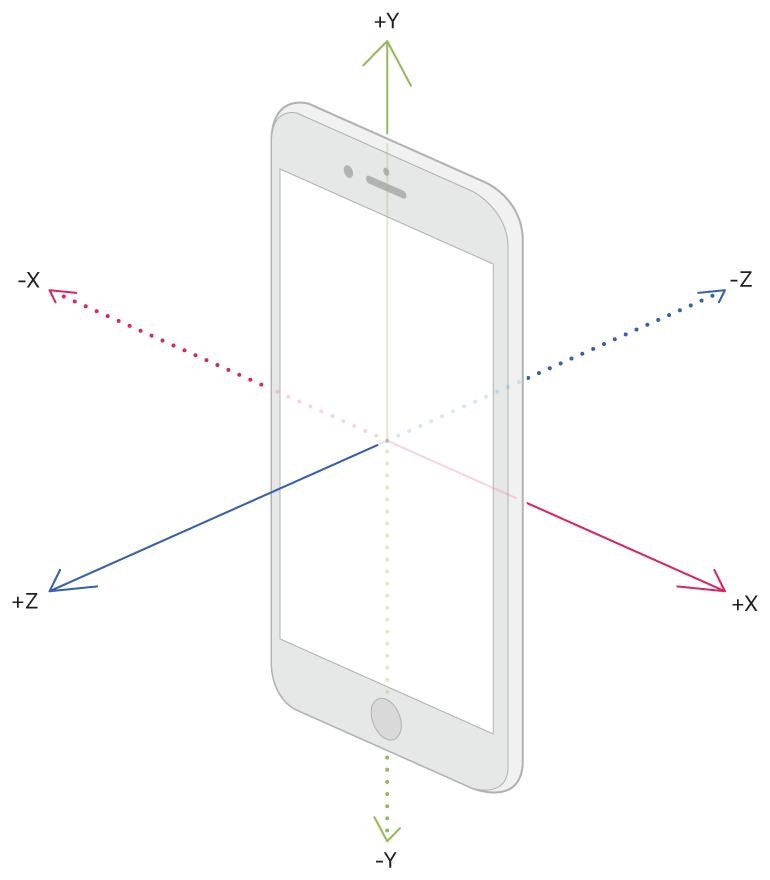

# 📍 meeter
<p align="center">
  
</p>

meet within meters, **meeter** 는 w3w 좌표체계를 기반으로, 나와 친구의 정확한 위치를 확인하고 실시간으로 공유할 수 있는 **하이퍼로컬 모바일 앱**입니다.

<hr>

* 시연 GIF 1 (로그인 - 로딩 - 내 위치 지도 초기 화면)
* 시연 GIF 2 (친구 탭 - 친구 확인 - 요청 보내기, 수락/거절 - 친구 리스트 // 디바이스 2대)
* 시연 GIF 3 (친구 여러 명 위치 같이 보이고 변하는 것)
* 시연 GIF 4 (w3w 위치 세밀하게 변하는 것 - 112, 119 신고 프롬프트 화면)
* 시연 GIF 5 (w3w 위치 친구에게 공유하고 확인하는 것)

# 🤠 Try It Out!

위 시연 화면이 재밌으셨나요? iPhone을 사용하신다면, 간단한 설치를 통해 meeter를 직접 체험해 볼 수도 있습니다!

<details>
<summary>meeter 설치 따라하기</summary>
<div>
1. https://testflight.apple.com/join/nrlNSHda

</div>
</details>

크로스플랫폼 앱 개발 프레임워크인 React Native 덕에, Android 베타 테스트도 곧 지원할 예정이에요.

## Apple TestFlight


* Apple TestFlight에 대한 간단한 설명
* 익명의 베타 테스터가 되지만, 개인정보는 아무것도 수집하지 않아요.
* 만약 구글 로그인이 꺼려진다면, 이 로그인 정보를 사용하세요. Apple 심사 팀에서도 이 계정정보를 활용해서 앱을 테스트 했답니다! (낮은 확률로 MFA가 필요할 수 있어요 :sob: 그 경우에는 직접 구글 로그인을 하셔서 테스트를 진행하시면 된답니다.)
  * meeter.ios@gmail.com
  * MeeterIos0101@
* 베타 테스트 도중 버그나 문제가 발견했을 때 개발자에게 피드백을 직접 전송할 수 있어요 (스크린샷과 함께). 베타 테스트 피드백은 세심하게 검토해서 다음 빌드에 최대한 반영하는 것을 목표로 하고 있어요.

* 지금 당장은 체험이 어렵다면, 시연이 포함된 5분 내외의 meeter 발표 영상을 보실 수도 있어요 :wink:
* 시연 영상 썸네일 + 특정 타임스탬프로 링크

# :book: Table of Contents


# 💡 Motivation

# 🎨 Tech Stack
* React Native
* Expo
* Zustand
* Socket.IO
* Apple MapKit JS
* Node.js
* Express
* MongoDB
* Apple TestFlight
* AWS Elastic Beanstalk

<!-- | React Native | Expo | Zustand | Socket.IO | Apple MapKit |
| --- | --- | --- | --- | --- |
| | 

| Node.js | Express | MongoDB | Apple TestFlight | AWS EB |
| --- | --- | --- | --- | --- |
| | | -->

## 🧐 Why React Native + Expo


## 🧐 Why Zustand

# 📲 Features

# 🎢 Challenges

## 실시간 위치 데이터를 어떻게 효율적으로 다룰까?
위치 데이터만큼이나 그 정확도와 실시간성이 중요한 데이터가 있을까요? 위치 데이터를 이용하는 대표적인 서비스인 내비게이션만 생각해 보아도, 위치 데이터는 **얼마나 실시간에 가깝게, 얼마나 적은 오차**로 현재 위치를 나타낼 수 있는가에 따라 그 가치가 좌우됩니다.

그럼 실시간으로 나와 내 친구의 위치를 지도에 표시해준다 — 라는 핵심 기능을 약속한 meeter 앱에서는 어떻게 실시간 위치 데이터를 다뤄야 할까요? 이상적으로는, meeter 앱이 켜져 있는 내내 GPS로 내 현재 위치를 지속적으로 모니터링해서, 새로운 위치값이 확인될때마다 위치 마커를 새로이 re-rendering 하고, 동시에 내 모든 친구들에게 소켓을 통해 새로운 위치값을 알려주면 되겠죠.

**하지만 현실은 녹록치 않습니다.**

만약 앱 사용 내내 GPS로 내 현재 위치를 모니터링한다면, 위치가 딱히 변하지 않아도 GPS는 계속해서 휴대폰 배터리를 소모하고 있게 됩니다.

뿐만 아니라, 정말 자그마한 움직임에도 새로운 위치값을 친구들에게 소켓으로 전송한다면, 소켓 부하가 상당할 것입니다. 만약 meeter 앱을 100명, 1000명의 사용자가 동시에 사용하게 된다면, 이 부하는 서비스 안정성에 치명적일 수 있습니다.

그래서 저는 실시간 위치 데이터가 처리되는 과정을 **2단계로 나누어 정의했고, 단계별로 최적화를 진행**했습니다.

1. 기기가 GPS를 사용해 위치 데이터를 받아오는 과정
2. 갱신된 새로운 위치 데이터를 소켓과 서버로 보내는 과정

### GPS 위치센서는 배터리 도둑 🪫
사실 저도 개발 후 베타 테스트 단계에서야 이 점을 체감했는데요, **GPS는 스마트폰 배터리를 충격적으로 많이 소모합니다**.

> Nonetheless, even with A-GPS, using your GPS is a noticeable battery hog. This is again due not to powering the GPS itself, but by preventing the phone from going to sleep. Compounding the cost, most mapping software is processor-intense. A well-designed app can make a significant difference here; Google Maps boasts several optimizations to reduce battery consumption from GPS usage.
>
> — Robert Love, Senior Director of Engineering at Google Cloud Platform, on ["Why does GPS use so much more battery than any other antenna or sensor in a smartphone?"](https://qr.ae/pK3Q0m) asked on Quora

위 답변에서도 확인할 수 있듯, GPS는 그 특유의 매우 느린 통신 속도와, 기기를 잠들지(sleep) 못하게 하는 특성 때문에 배터리를 많이 사용합니다.

이 사실에 슬퍼하면서도, 저는 동시에 답변의 마지막 문장에 주목했습니다: `잘 디자인된 앱은 획기적인 차이를 만들어낼 수 있습니다. Google Maps는 GPS 사용에 따른 배터리 소모를 줄이기 위해 여러 최적화 기술을 자랑합니다.` 물론 meeter 앱이 구글 맵 수준의 최적화를 달성할 순 없겠지만, 어떻게 하면 **위치 데이터의 가치를 유지하면서도 GPS 사용을 최대한 줄일 수 있을지 고민**했습니다.

### 기기가 움직였을 때만 GPS를 사용하자
GPS 사용을 최대한 줄인다는 것은 곧, **꼭 필요할때만 GPS를 사용하도록 한다**는 것입니다. 그럼 GPS 사용이 꼭 필요할 때는 언제일까요? 사용자의 위치가 바뀌면, 그 새로운 위치정보를 받아오기 위해 GPS를 사용해야 합니다. 반면에, 사용자의 기기는 가만히 있는데 GPS만 계속해서 위치를 모니터링하고 있는 상황은 피해야 하죠.

하지만 역설적이게도, 기기가 움직였는지를 알려면 결국 GPS를 사용해야하는 듯 했습니다. **GPS로 받아 온 조금 전의 위치와 현재 위치를 비교하여 기기가 움직였는지를 판단하기 때문이죠.** 심지어 React Native Community에서 제공하는 `Geolocation API` 또한 이러한 방식으로 사용자 기기가 움직였는지를 판별하고 있었습니다. 결국 GPS를 사용하지 않고 사용자 기기의 움직임을 탐지하겠다는 시도는 애초에 말이 안되는 듯 보였습니다.

그 순간, iPhone의 두 가지 흥미로운 기능들이 제 뇌리를 스쳤습니다. iPhone은 GPS 위치센서가 꺼져 있어도, 사용자가 교통사고를 당했는지, 또는 운전중인지를 감지할 수 있습니다. **어떻게 GPS 없이 이러한 사용자의 움직임을 파악할 수 있을까요?**

<!-- <figure>
  
  <figcaption>대부분의 최신 모바일 기기에서 지원하는 충돌 감지 기능과 운전 감지 기능</figcaption>
</figure> -->


> So how does this technology work? The new iPhone models, along with the Watch Series 8 and Ultra, have **a 3-axis gyroscope and a high G-4 accelerometer, which samples motion at over 3000 times a second**. It means that when a car is going really fast and then abruptly stops or slows down, it's able to sense the precise moment of impact, or the change in that motion.
>
> — The Wall Street Journal, [Does Apple's Crash Detection Work? We Totaled Some Cars To Find Out.](https://youtu.be/0nTQIvfVHrw?si=XZvy5xZ15Ra_2lz5&t=220)

모든 스마트폰에는 가속도센서(accelerometer)가 내장되어 있는데, 이는 GPS 센서와 다르게 별도의 통신을 요하지도, 따라서 배터리도 거의 소모하지 않습니다. iPhone은 기기의 움직임 여부와 그 정도를 측정할 수 있는 가속도센서와 자체 알고리즘을 활용해서, 사용자의 비정상적이거나 특이한 움직임 패턴을 탐지해냅니다.

이 점에 착안해서, meeter는 **가속도센서의 작동을 곧 사용자의 움직임으로 간주하고, 비로소 GPS 위치센서를 작동**합니다. 이렇게 기기가 확실히 움직였을 때만 GPS를 사용하도록 설계하여, 불필요한 GPS 작동을 막고 기기 성능과 배터리 효율을 높였습니다.

### 네이티브 기기가 가속도 값을 제공하긴 하는데.. :thinking:
그럼 네이티브 기기의 가속도센서 측정값을 어떻게 사용할 수 있을까요? Apple은 `Core Motion` 프레임워크를 통해 일반 가속도 값(raw acceleration)을 제공합니다.

<p align="center">
  
</p>

위 그림과 같이, 가속도센서는 `x`, `y`, `z` 3차원 축을 따라 작용하는 가속도 측정값을 제공합니다.

그리고 저는 이를 이용하는 Expo의 `expo-sensors` 를 통해 일반 가속도 값에 접근할 수 있었습니다. 아래 화면은 제가 휴대폰을 평평한 책상 위에 가만히 놓고 측정한 일반 가속도 값입니다.

<p align="center">
  
</p>

그런데 뭔가 이상하지 않나요? **기기는 `x`, `y`, `z`축 어떤 방향으로도 움직이지 않고 있는데, `z`축 가속도 값은 `-1`로 수렴하는 것으로 보입니다**.

이는 바로 가속도 센서가 제공하는 일반 가속도 값이 지구가 기기를 끌어당기는 중력 또한 기기에 적용되는 '움직임'이라고 간주해서, 중력이 작용하는 방향으로 `1g = 9.81m/s^2` 만큼의 값을 항상 포함하고 있기 때문입니다.

그래서 화면을 위로 한 채로 평평한 책상 위에 둔 제 휴대폰에는 `-z`축 방향으로 `1g`만큼 중력이 작용하고 있었고, 그래서 `z`축 일반 가속도 값은 `-1`로 나타났던 것입니다.

하지만 저는 중력이 작용하는 방향과 관계없이 순수 사용자의 움직임만으로 발생하는 기기의 가속을 측정해야 하기에, **`일반` 가속도 값에서 중력의 영향을 제거한 `선형` 가속도 값을 구해서 사용하기로 결정**했습니다.

### 일반 가속도 값을 선형 가속도 값으로 변환하기
일반 가속도 값은 뉴턴의 제2법칙인 가속도의 법칙 $F = ma$ 로부터 출발합니다. 여기서 $F$ 는 알짜힘(합력), 즉 쉽게 말하면 작용하는 힘, $m$ 은 질량, $a$ 는 가속도를 의미합니다.

이 공식을 활용해서 네이티브 기기가 제공하는 일반 가속도 값을 정의해 볼 수 있습니다.

$A_D = -\frac{1}{m} \sum F_S - g$

여기서 $A_D$ 는 기기에 작용하는 가속도 (**A**cceleration on **D**evice), $m$ 은 질량, $F_S$ 는 가속도 센서 자체에 작용하는 힘 (**F**orce on **S**ensor)을 각각 의미합니다. 또한 앞서 살펴보았듯이, 일반 가속도 값은 항상 중력을 포함하여 계산되기에, 중력 (**g**ravity)을 의미하는 $g$ 도 포함됩니다.

이제 **일반 가속도 값에서 중력 가속도를 필터링하여 선형 가속도를 추정**해야 합니다. 우선 가속도 센서를 사용하여 가속도 데이터를 수집하고, 저속 통과 필터(low-pass filter)를 활용하여 중력 가속도를 추정합니다. 이후 중력 가속도를 원본 가속도에서 빼어 선형 가속도를 얻어내고, 이 값을 상태로 업데이트하여 활용합니다.

```javascript
export default function App() {
  const [{ x, y, z }, setRawAcc] = useState({
    x: 0,
    y: 0,
    z: 0,
  });

  const [{ linearAccX, linearAccY, linearAccZ }, setLinearAcc] = useState({
    linearAccX: 0,
    linearAccY: 0,
    linearAccZ: 0,
  });
  const [subscription, setSubscription] = useState(null);

  const _slow = () => Accelerometer.setUpdateInterval(1000);
  const _fast = () => Accelerometer.setUpdateInterval(100);

  const alpha = 0.8;
  let gravityX = 0;
  let gravityY = 0;
  let gravityZ = 0;

  const _subscribe = () => {
    setSubscription(Accelerometer.addListener(({ x, y, z }) => {
      setRawAcc({ x, y, z });

      gravityX = alpha * gravityX + (1 - alpha) * x;
      gravityY = alpha * gravityY + (1 - alpha) * y;
      gravityZ = alpha * gravityZ + (1 - alpha) * z;

      const linearAccX = x - gravityX;
      const linearAccY = y - gravityY;
      const linearAccZ = z - gravityZ;


      setLinearAcc({ linearAccX, linearAccY, linearAccZ });
    }));
  };
}
```

결국 이 코드의 핵심은 디바이스의 물리적인 움직임에서 나오는 가속도를 정확하게 추출해내기 위한 필터링과 계산 과정입니다. 이제 일반 가속도와 선형 가속도를 함께 확인해 볼까요?

<p align="center">
  
</p>

휴대폰을 평평한 테이블 위에 가만히 놓았을 때, 선형 가속도의 `x`, `y`, `z`축 값 모두 0에 가까이 수렴하는 것을 확인할 수 있습니다.

**결국 기기에 작용하는 선형 가속도의 측정값이 특정 값 이상일때만 GPS 센서를 작동시켜, 기기와 배터리 성능을 최적화하고 사용자 경험을 증진시킬 수 있었습니다.**


### 과도한 소켓 통신
meeter 앱은 사용자 간 위치정보 공유를 위해 socket.IO 를 사용합니다. 아래 도식은 이상적인 상황에서의


### "의미있는" 위치변화가 있을 때만 소켓으로 공유하자

유의미하다 = 친구에게 내 변경된 위치를 알려줄만큼 위치가 변했다
5초마다 한번? 위치가 변경되지 않았다면..? 예를 들어서 자고 있을때는?
거리가 10m 이상 차이나면? 그러면 GPS를 거의 항시 켜놓고 계속해서 위치정보를 확인해야 하는데..


가속도센서 변화가 감지되면 (기기 성능 및 배터리 소모 최적화) => GPS 확인하고 => timeInterval, distanceInterval 체크해서 변화가 유의미하다고 판단되면, 그때 (소켓 최적화) => 소켓 emit

(소켓 도식 as-is vs. to-be)
#### Last Known Location?

## 최초 지도 로딩 지연, 어떻게 사용자 친화적으로 해결할까?
### react-native-maps와 그 한계점
### 기존 해결책들
### 웹뷰를 통해서 MapKit JS를 직접 받아오고, 받아오는 데이터의 크기를 줄이자!
inspired by 애플 테크 발표 영상

## 자기참조형 데이터 모델링을 이용한 용량 효율적인 쿼리 구현

## 

# :books: Lessons Learned
## 사용자 경험의 pain point를 기술로 해결하기
베타 테스트


## 능동적이고 창의적인 문제해결 과정
논문, Github Issues
여러가지 가능성을 비교탐구하고, 합리적인 근거를 들어 채택하는 과정

<!-- # :telescope: Looking Forward -->
